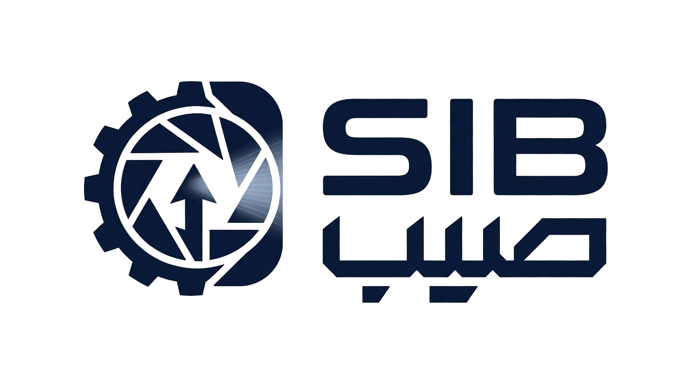

  
  
  # SIB (Sanat Yar Bina)
  **An Edge-Deployed Cyber-Physical Steel Inspection System**

## 👥 Project Team
This project was researched, developed, and engineered by:
* **MohammadAmin M.Shabestari**
* **M.sobhan sakhaei**
* **Arian Khoshnevis**
* **Hasti mohammadi**

---

## 📖 Project Summary
**SIB (Sanat Yar Bina)** is an advanced industrial cyber-physical system designed to fully automate the inspection of steel surfaces in real-time. Engineered specifically for serverless, edge-deployed environments, the system fuses state-of-the-art artificial intelligence with mechanical hardware orchestration. 

The core architecture leverages a **YOLOv8** computer vision pipeline for microsecond defect detection and a **Hybrid Fuzzy-Reinforcement Learning (RL)** controller to dynamically adjust conveyor belt speeds without motor chattering. Furthermore, it integrates a quantized **Small Language Model (SLM)** to generate autonomous, natural-language shift reports. The entire physical pipeline is mirrored by a **Digital Twin** in Webots, allowing for safe, isolated validation before physical deployment.

---

## 🗺️ Repository Navigation (Quick Guide)
To help you understand the structure of this repository at a first glance, the project is distinctly separated into **Software Development** and **AI Research**.

### 💻 1. Main Software & Application Code
* 📁 **[`sanat_yar_bina/`](./sanat_yar_bina/)**
  * **Look here for:** The complete production source code, GUI (PyQt5) scripts, database managers, and the `main.py` system orchestrator. 
  * *Note: Click the link above to view the dedicated README detailing the software architecture and instructions on how to run the application.*

### 🔬 2. AI Training Results & R&D
* 📊 **[`Yolo and Controller/`](./Yolo%20and%20Controller/)**
  * **Look here for:** All training notebooks, ablation studies, model soups, performance graphs, and the experimental history of our YOLO vision models and RL controllers. 

### 📁 3. Additional Resources
* 🗃️ **`Dataset/` & `dataset analyse/`:** The raw/processed industrial images and data analysis scripts used to train the vision module.
* 🤖 **`simulation_webot/`:** The standalone Webots digital twin project files and 3D worlds.
* 📄 **`Final Report SIB.pdf`:** The comprehensive, finalized technical report detailing the system's methodology, architecture, and complete mathematical findings.